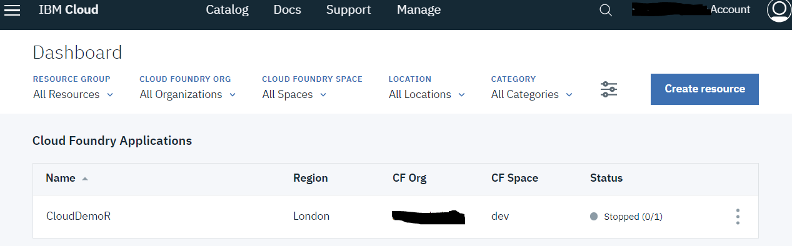
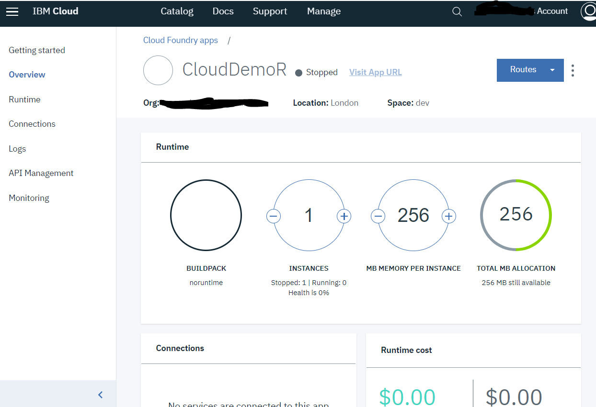
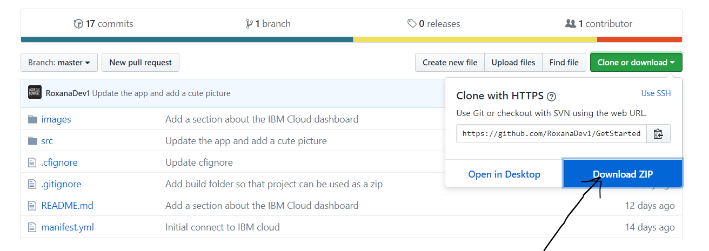
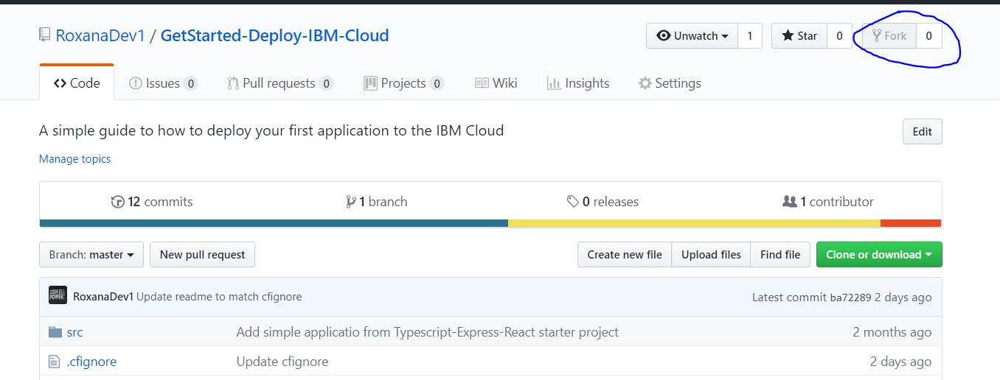
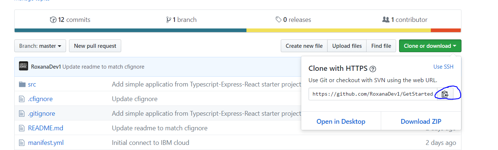

# GetStarted-Deploy-IBM-Cloud

# Work in progress...

Welcome to my "Get Started" series!

In this repository I am going to reuse my previous code from "GetStarted-TypeScript-Express-React" and show with detailed steps how to deploy this code into the cloud. The code is slightly modified in this repository to match the needs for deploying an application to the cloud, but the basics are the same.
Notice that the application does not do much, it is just a base setup and "Hello world" frontend attached to it.

I have chosen IBM Cloud as no credit card or pre-information is needed in order to register or start working with it.

The guide can also orient new cloud users, or users which would like to learn more about how to work with cloud platforms a quick start.

I would recommend having some experience with the tooling on your PC or MAC such as command line, and some minimal previous understanding of code (if you would like to look into the code).

## Pre-requirements

Please go through the following in order to be able to work with IBM Cloud:

1. Register for a free account here: https://console.bluemix.net/registration

Note - No credit card is needed for a free registration nor for creating a simple application.

2. Get the IBM Cloud command line tools for your operating system: https://console.bluemix.net/docs/cli/reference/ibmcloud/download_cli.html#install_use

3. Command line:

- Windows: Windows regular command line should be enough.

- Mac: iTerm or the regular command line.

  **Optional - This part is not needed in order to complete the flow**

Use this part if you would wish to build the GitHub repository locally.

4. Git installed on the machine for working with Git code.

- PC - GitBash
- Macs - iTerm should be enough.

5. Github account for forking the repository and make sure it runs locally. If you do not know how to do this, please follow the instructions at the end of the file.

6. npm tools installed

7. If you do decide to fork the repository, make sure to:

```
npm install

npm run build

npm start
```

## Understanding the tools we will be using

### IBM Cloud - PaaS

The IBM cloud platform, like other providers is a PaaS. As described by Wikipedia:

"Platform as a Service (PaaS) or platform-based service is a category of cloud computing services that provides a platform allowing customers to develop, run, and manage applications without the complexity of building and maintaining the infrastructure typically associated with developing and launching an app"
https://en.wikipedia.org/wiki/Platform_as_a_service

PaaS is quite popular today in application development, those platforms allow us to run our application without worrying too much about computing power and infrastructure. As we will see later, we will be able to deploy our web application in the cloud using a couple of simple commands.

There are many big advantages of running on the cloud. Using a PaaS provider will not only allow us to run our application, but it has a full catalog of services which we can utilize in order to be more efficient and faster to production.

Note - Running application on the cloud is not always free, it is correct that we worry less about computing power and infrastructure, but if our computing and storage needs are huge, it will be wrong to say that no cost is associated with it.

### Cloud foundry

Cloud foundry is an open source cloud application platform (https://www.cloudfoundry.org/).
We will use cloud foundry in order to host our small web application on the IBM Cloud.
There are plenty of advantages for cloud foundry (or cf in short) which can be read on their website provided.
We use Cloud foundry as it allows us to easily setup and run our application. You can think about it as something that takes our code, puts it in a box and then places that box on the cloud.
This "box" will usually be aware of what code we are using, this is called "buildpack". For example, it is very popular today to run Javascript on the cloud using Node.js, this means that the buildpack recognized would be Node.js.

### Why do we use the command line?

I know not everyone is a fan of command line, as the user interface is super simple and not always very informative. In this case I think the command line would be the fastest way to get this application up and running.

# Let's get started!

## Connecting to your IBM Cloud account using the command line.

Under this section we will connect to the IBM Cloud using our command line.
We will have to connect to the IBM Cloud in order to deploy our application in the correct place.

Follow the below steps, where each contains a bit of explanation what do they mean.

1. `ibmcloud login -a api.eu-gb.bluemix.net --sso`

The above command would log you in from command line to your account on IBM Cloud. A new browser window will be opened where you will be able to login and get a one time code to use.
Copy the code into the command line, and click enter.

Note - on PC you can right click the code in and click enter (the code is not visible on purpose).
On a Mac you can just cmd + v in your command line.

Once logged in you should be able to see some information about your account, for example region. Region is where in the world your application will be deployed, or where is the data center is located.
Usually we target the closest one, for us is the UK as we work on a free account.

Notice that free accounts are usually created under the UK region. If you do know how to navigate with cf tools you can just use the following:

`ibmcloud login --sso`

2. `ibmcloud target --cf`

Now let's setup our Cloud foundry.

If you look back in the information displayed on the screen after logging in there are 3 empty lines:

`CF API endpoint, Org and Space`

Those are the ones we will be fill by using the command above.
If everything went as it should, the new information on the screen will contain those lines filled.

By default it should target the same place as our API endpoint.

3. Download the GitHub Repository as a Zip, using the instructions under:

`Download the GitHub Repository as ZIP`

The section is found lower in this guide.

4. Setup your application name:

Navigate to `<POJECT_FOLDER\>` with your favorite file browser, and open the file `manifest.yml`
Change the application name under `- name: CloudDemoR`
Save the file.

**Background**

We would need to have 2 files in order to deploy a Cloud foundry application:

- `manifest.yml` - This file is like a setup file for Cloud foundry. The file contains some basic setup functions like, how our application should be named or how much memory should it consume?
- `.cfignore` - This file is important as Cloud foundry is smart and knows how to do some things for us, so when we upload our application the files mentioned in .cfignore would be not uploaded and ignored, mainly because Cloud foundry knows how to re-create them.
  An example is node_modules - Cloud foundry knows how to npm install the dependency without us uploading them.

  **manifest.yml**
  Your code should already contain this file, go ahead and change the name of the application under name. If everyone used the same name, we will not be able to all deploy as the names would create conflicts.

  ```
  applications:
  - name: YOUR_NAME_HERE
  memory: 256M
  buildpack: https://github.com/cloudfoundry/nodejs-buildpack
  ```

  **.cfignore**
  Nothing to do here, those are the libs which we do not need to upload.

  ```
  node_modules
  ```

5. Publish the application to the cloud!

Navigate to the location of the code using:

`cd FOLDER_NAME` - to go into a folder.

`cd ..` - to go outside a folder

Execute:

`ibmcloud cf push`

If everything went OK, your application should be running in the cloud, and you can access it via the following link:

`<YOU_APP_NAME>.eu-gb.mybluemix.net`

6. Done!

## Using the IBM Cloud web dashboard

On the dashboard you will be able to see your application and it's status:



You are also able to see all the information we went through earlier from command line, like where is the application deployed to.

Notice the 3 dots on the right side of the line. This is a menu where you can control your application for example: start, rename and delete application.
I would recommend to stop and/or delete your demo application when done working.

When clicking on the application, another dashboard will open:



In this dashboard there are a few more options, things like seeing the Logs. Logs are really important when running an application, if something happens or crashes, you will be able to see this in the logs.
Another cool thing one can do is change the amount of memory the application is using (remember this is a free account so we are limited), but ideally we can control how much we use and make sure we are not using more then needed.

There are many more things which can be added and done through the dashboard, which we can hold for another session.

## Deactivating the IBM Cloud account

If you would like to deactivate the account, you will need to do this from the dashboard.
On the top navigation bar select:

`Manage -> Billing and usage -> Billing -> Scroll all the way down -> Deactivate this account`

## Download the GitHub Repository as ZIP

1. Use the download Zip button on GitHub



2. Once the Zip is downloaded, unzip the file in your favorite folder.

3. Done!

## Fork GitHub repository

1. Use the fork button marked in the image:



2. Create a local copy of the repository once cloned

Copy the address to your forked repository:


Open your GitBash:

- Navigate to the directory you wish to have the repository in.
- Use: `git clone <COPIED_LINK>`
- Login to git if needed.
- Wait for the process to be finished.

3. Done!
